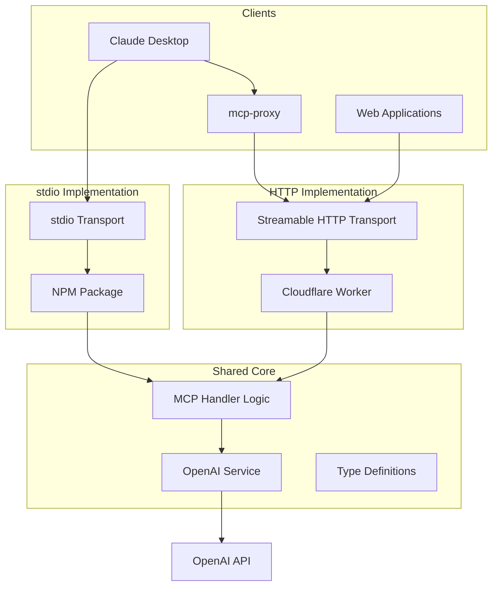

# MCP Transport Requirements and Implementation Analysis

## Executive Summary

This document provides a comprehensive analysis of Model Context Protocol (MCP) transport requirements and implementation options for achieving cross-device compatibility. Our current Cloudflare Worker implementation uses custom HTTP-only transport that is incompatible with standard MCP clients like Claude Desktop and `mcp-proxy`. This analysis examines the exact requirements, identifies compatibility issues, and provides clear recommendations for achieving maximum compatibility.

## Table of Contents

1. [Current Implementation Analysis](#current-implementation-analysis)
2. [MCP Transport Specification Analysis](#mcp-transport-specification-analysis)
3. [Standard MCP Client Expectations](#standard-mcp-client-expectations)
4. [Why Our Current Implementation is Incompatible](#why-our-current-implementation-is-incompatible)
5. [Transport Options Comparison](#transport-options-comparison)
6. [Implementation Strategies](#implementation-strategies)
7. [Technical Requirements](#technical-requirements)
8. [Recommended Architecture](#recommended-architecture)
9. [Migration Path](#migration-path)
10. [Conclusion](#conclusion)

## Current Implementation Analysis

### What We Have

Our current Cloudflare Worker MCP server implements:

- **Custom HTTP-only transport** via Cloudflare Workers
- **JSON-RPC 2.0** message format (✅ compliant)
- **API key authentication** via URL path (`/mcp/{api-key}`)
- **Standard MCP methods**: `initialize`, `tools/list`, `tools/call`
- **CORS support** for web applications
- **Vector store tools** for OpenAI integration

### Current Architecture

```
[Client] --HTTP POST--> [Cloudflare Worker] --OpenAI API--> [Vector Stores]
```

### Key Files Analysis

- **[`src/worker.ts`](src/worker.ts)**: Main entry point with HTTP routing and CORS
- **[`src/mcp-handler.ts`](src/mcp-handler.ts)**: MCP protocol implementation
- **[`src/types.ts`](src/types.ts)**: Type definitions (mostly MCP-compliant)
- **[`test-mcp-http-client.js`](test-mcp-http-client.js)**: Custom HTTP client for testing

## MCP Transport Specification Analysis

### Official MCP Transport Protocols

According to the [MCP specification (2025-06-18)](https://modelcontextprotocol.io/specification/2025-06-18/basic/transports), MCP defines two standard transport mechanisms:

#### 1. stdio Transport (Primary)

- **Usage**: Communication over standard input/output streams
- **Client behavior**: Launches MCP server as subprocess
- **Message format**: JSON-RPC messages delimited by newlines
- **Requirements**:
  - Messages MUST NOT contain embedded newlines
  - Server MUST NOT write non-MCP content to stdout
  - Server MAY write logs to stderr
- **Status**: **REQUIRED** - Clients SHOULD support stdio whenever possible

#### 2. Streamable HTTP Transport

- **Usage**: HTTP POST and GET requests with optional Server-Sent Events
- **Endpoints**: Single endpoint supporting both POST and GET
- **Message flow**:
  - Client → Server: HTTP POST with JSON-RPC message
  - Server → Client: Either `application/json` or `text/event-stream`
- **Required headers**:
  - `Accept: application/json, text/event-stream`
  - `MCP-Protocol-Version: 2025-06-18`
- **Session management**: Optional via `Mcp-Session-Id` header
- **Security requirements**:
  - MUST validate `Origin` header (DNS rebinding protection)
  - SHOULD bind to localhost only for local servers
  - SHOULD implement proper authentication

### Protocol Version Requirements

- **Current version**: `2025-06-18`
- **Version negotiation**: Required during initialization
- **Backward compatibility**: Servers SHOULD assume `2025-03-26` if no version header
- **Version header**: `MCP-Protocol-Version: <protocol-version>` required for HTTP

### Session Management

- **Session ID**: Optional `Mcp-Session-Id` header
- **Lifecycle**: Initialize → Use → Terminate
- **Termination**: HTTP DELETE to endpoint with session ID

## Standard MCP Client Expectations

### Claude Desktop

**Transport Support**:
- **Primary**: stdio transport only
- **Configuration**: JSON config file with `command` and `args`
- **Subprocess management**: Launches servers as child processes
- **Environment**: Isolated environment, requires explicit env vars

**Configuration Format**:
```json
{
  "mcpServers": {
    "server-name": {
      "command": "npx",
      "args": ["mcp-proxy", "https://server.url/sse"],
      "env": {}
    }
  }
}
```

**Limitations**:
- Cannot directly connect to HTTP/SSE servers
- Requires proxy tools like `mcp-proxy` for remote servers
- No built-in authentication for remote servers

### mcp-proxy (Bridge Tool)

**Purpose**: Bridge between stdio and HTTP/SSE transports

**Two modes**:
1. **stdio → SSE**: Allows Claude Desktop to connect to remote SSE servers
2. **SSE → stdio**: Exposes local stdio servers via SSE

**Key Features**:
- Handles transport translation
- Supports authentication headers
- Manages session state
- Provides CORS support

**Usage with Claude Desktop**:
```json
{
  "mcpServers": {
    "remote-server": {
      "command": "npx",
      "args": ["mcp-proxy", "https://remote.server/sse"],
      "env": {}
    }
  }
}
```

### Other MCP Clients

**Cursor**: Supports both stdio and unauthed SSE servers directly
**Windsurf**: Similar to Cursor with MCP support
**Custom clients**: Can implement any transport as needed

## Why Our Current Implementation is Incompatible

### 1. Transport Protocol Mismatch

**Our implementation**:
- Uses simple HTTP POST requests
- Returns JSON responses directly
- No SSE support
- No stdio support

**Standard expectation**:
- stdio transport (primary)
- Streamable HTTP with SSE support (secondary)
- Specific header requirements
- Session management

### 2. Missing Required Headers

**Our server doesn't handle**:
- `MCP-Protocol-Version` header validation
- `Accept` header with `text/event-stream`
- `Mcp-Session-Id` for session management

**Standard clients send**:
- `Accept: application/json, text/event-stream`
- `MCP-Protocol-Version: 2025-06-18`
- Optional session headers

### 3. Endpoint Structure Differences

**Our endpoints**:
- `/mcp/{api-key}` - Custom authentication pattern
- Single POST endpoint
- No SSE endpoint

**Standard expectation**:
- Single endpoint supporting both POST and GET
- SSE stream support via GET requests
- Standard authentication mechanisms

### 4. Authentication Method

**Our approach**:
- API key in URL path
- Custom authentication logic

**Standard approach**:
- OAuth 2.1 for remote servers
- Environment variables for local servers
- Bearer tokens in headers

### 5. No stdio Support

**Critical gap**: Our Cloudflare Worker cannot provide stdio transport, which is the primary requirement for standard MCP clients like Claude Desktop.

## Transport Options Comparison

### stdio Transport

**How it works**:
- Server runs as subprocess of client
- Communication via stdin/stdout
- JSON-RPC messages separated by newlines

**Pros**:
- ✅ Standard MCP transport (REQUIRED)
- ✅ Direct Claude Desktop compatibility
- ✅ No network overhead
- ✅ Implicit trust model
- ✅ Simple authentication via environment variables

**Cons**:
- ❌ Local execution only
- ❌ Requires Node.js/Python on each device
- ❌ No remote access
- ❌ Cannot leverage Cloudflare Workers benefits

**Implementation requirements**:
- Node.js or Python executable
- Package distribution (npm/pip)
- Dependency management
- Cross-platform compatibility

### Streamable HTTP Transport (MCP-compliant)

**How it works**:
- HTTP POST for client-to-server messages
- HTTP GET for server-to-client SSE streams
- Single endpoint supporting both methods
- Optional session management

**Pros**:
- ✅ Official MCP standard
- ✅ Remote server capability
- ✅ Scalable architecture
- ✅ Can leverage Cloudflare Workers
- ✅ Supports real-time notifications

**Cons**:
- ❌ Limited client support (requires proxy for Claude Desktop)
- ❌ More complex implementation
- ❌ Network latency
- ❌ Authentication complexity

**Implementation requirements**:
- SSE support
- Session management
- Proper header handling
- Security considerations

### Custom HTTP (Current Implementation)

**How it works**:
- Simple HTTP POST requests
- JSON responses
- Custom authentication

**Pros**:
- ✅ Simple implementation
- ✅ Works with custom clients
- ✅ Leverages Cloudflare Workers

**Cons**:
- ❌ Not MCP-compliant
- ❌ No standard client compatibility
- ❌ Requires custom integration
- ❌ Limited ecosystem benefits

## Implementation Strategies

### Option A: NPM Package with stdio Transport

**Approach**: Convert Cloudflare Worker logic to Node.js stdio server

**Architecture**:
```
[Claude Desktop] --stdio--> [Node.js MCP Server] --HTTP--> [OpenAI API]
```

**Implementation steps**:
1. Create Node.js package structure
2. Implement stdio transport layer
3. Port MCP handler logic
4. Add OpenAI service integration
5. Package for npm distribution

**Code structure**:
```
mcp-openai-vector-store/
├── package.json
├── src/
│   ├── index.js          # stdio entry point
│   ├── mcp-handler.js    # ported from current implementation
│   ├── openai-service.js # ported from current implementation
│   └── types.js          # type definitions
└── README.md
```

**Package.json example**:
```json
{
  "name": "mcp-openai-vector-store",
  "version": "1.0.0",
  "bin": {
    "mcp-openai-vector-store": "./src/index.js"
  },
  "dependencies": {
    "@modelcontextprotocol/sdk": "^1.0.0"
  }
}
```

**Pros**:
- ✅ Maximum compatibility (Claude Desktop, etc.)
- ✅ Standard MCP ecosystem integration
- ✅ Easy distribution via npm
- ✅ Familiar development patterns

**Cons**:
- ❌ Requires Node.js on each device
- ❌ Local execution only
- ❌ Loses Cloudflare Workers benefits
- ❌ Dependency management complexity

### Option B: Enhanced Cloudflare Worker with MCP-compliant HTTP

**Approach**: Upgrade current Worker to support Streamable HTTP transport

**Architecture**:
```
[mcp-proxy] --SSE--> [Enhanced Cloudflare Worker] --HTTP--> [OpenAI API]
[Claude Desktop] --stdio--> [mcp-proxy]
```

**Required changes**:
1. Add SSE endpoint support
2. Implement proper header handling
3. Add session management
4. Update authentication mechanism
5. Add protocol version negotiation

**Implementation details**:

**New endpoint structure**:
```typescript
// Single MCP endpoint supporting both POST and GET
app.all('/mcp', async (request) => {
  if (request.method === 'GET') {
    return handleSSEConnection(request);
  } else if (request.method === 'POST') {
    return handleJSONRPCRequest(request);
  }
});
```

**SSE support**:
```typescript
function handleSSEConnection(request: Request): Response {
  const { readable, writable } = new TransformStream();
  
  return new Response(readable, {
    headers: {
      'Content-Type': 'text/event-stream',
      'Cache-Control': 'no-cache',
      'Connection': 'keep-alive',
    },
  });
}
```

**Header validation**:
```typescript
function validateMCPHeaders(request: Request): boolean {
  const protocolVersion = request.headers.get('MCP-Protocol-Version');
  const accept = request.headers.get('Accept');
  
  return protocolVersion === '2025-06-18' && 
         accept?.includes('text/event-stream');
}
```

**Pros**:
- ✅ Maintains remote server benefits
- ✅ Leverages Cloudflare Workers
- ✅ Can work with mcp-proxy
- ✅ Scalable architecture

**Cons**:
- ❌ Still requires proxy for Claude Desktop
- ❌ Complex implementation
- ❌ Limited direct client support
- ❌ SSE implementation challenges in Workers

### Option C: Dual Implementation

**Approach**: Maintain both NPM package and enhanced Worker

**Architecture**:
```
# Local usage
[Claude Desktop] --stdio--> [NPM Package] --HTTP--> [OpenAI API]

# Remote usage  
[Web App] --HTTP--> [Enhanced Worker] --HTTP--> [OpenAI API]
[Claude Desktop] --stdio--> [mcp-proxy] --SSE--> [Enhanced Worker]
```

**Shared code strategy**:
- Core MCP logic in shared module
- Transport-specific adapters
- Common OpenAI service layer
- Unified type definitions

**Implementation structure**:
```
packages/
├── core/                 # Shared MCP logic
│   ├── mcp-handler.ts
│   ├── openai-service.ts
│   └── types.ts
├── stdio-server/         # NPM package
│   ├── package.json
│   └── src/index.ts
└── worker-server/        # Cloudflare Worker
    ├── wrangler.toml
    └── src/worker.ts
```

**Pros**:
- ✅ Maximum compatibility and flexibility
- ✅ Best of both worlds
- ✅ Shared maintenance burden
- ✅ Different use cases supported

**Cons**:
- ❌ Increased complexity
- ❌ Dual maintenance overhead
- ❌ Potential version drift
- ❌ More testing required

## Technical Requirements

### stdio Transport Requirements

**Runtime dependencies**:
- Node.js 18+ or Python 3.8+
- MCP SDK (`@modelcontextprotocol/sdk`)
- HTTP client for OpenAI API

**Message format**:
```typescript
// Input: JSON-RPC message on stdin
{"jsonrpc":"2.0","id":1,"method":"tools/list","params":{}}

// Output: JSON-RPC response on stdout  
{"jsonrpc":"2.0","id":1,"result":{"tools":[...]}}
```

**Process management**:
- Handle SIGTERM gracefully
- Clean up resources on exit
- Proper error handling and logging

**Environment variables**:
```bash
OPENAI_API_KEY=sk-...
DEBUG=true  # optional
```

### Streamable HTTP Requirements

**Endpoint specification**:
- Single endpoint (e.g., `/mcp`)
- Support both GET and POST methods
- Content negotiation via Accept header

**Required headers**:
```http
# Client requests
Accept: application/json, text/event-stream
MCP-Protocol-Version: 2025-06-18
Content-Type: application/json

# Server responses
Content-Type: application/json | text/event-stream
MCP-Protocol-Version: 2025-06-18
```

**SSE message format**:
```
data: {"jsonrpc":"2.0","id":1,"result":{"tools":[...]}}

```

**Session management**:
```http
# Optional session header
Mcp-Session-Id: uuid-session-id
```

**Security requirements**:
- Origin header validation
- HTTPS enforcement (except localhost)
- Proper CORS configuration
- Authentication mechanism

### Authentication Requirements

**For stdio servers**:
- Environment variables for API keys
- No network authentication needed

**For HTTP servers**:
- OAuth 2.1 support (recommended)
- Bearer token authentication
- API key authentication (alternative)
- Proper token refresh handling

## Recommended Architecture

### Primary Recommendation: Dual Implementation (Option C)

Based on the analysis, I recommend implementing **Option C: Dual Implementation** for the following reasons:

1. **Maximum Compatibility**: Supports both local and remote use cases
2. **Future-Proof**: Adapts to evolving MCP client capabilities
3. **Ecosystem Integration**: Works with standard tools and custom applications
4. **Flexibility**: Users can choose the deployment model that fits their needs

### Implementation Priority

**Phase 1: NPM Package (stdio)**
- Highest compatibility impact
- Enables Claude Desktop integration
- Relatively straightforward implementation
- Immediate ecosystem benefits

**Phase 2: Enhanced Worker (Streamable HTTP)**
- Maintains remote server benefits
- Supports web applications
- Enables advanced features
- Future-proofs the implementation

### Shared Architecture



### Code Organization

```
mcp-openai-vector-store/
├── packages/
│   ├── core/                    # Shared logic
│   │   ├── src/
│   │   │   ├── mcp-handler.ts
│   │   │   ├── openai-service.ts
│   │   │   ├── types.ts
│   │   │   └── index.ts
│   │   └── package.json
│   ├── stdio-server/            # NPM package
│   │   ├── src/
│   │   │   ├── index.ts
│   │   │   └── stdio-transport.ts
│   │   ├── package.json
│   │   └── README.md
│   └── worker-server/           # Cloudflare Worker
│       ├── src/
│       │   ├── worker.ts
│       │   └── http-transport.ts
│       ├── wrangler.toml
│       └── package.json
├── examples/                    # Usage examples
├── docs/                       # Documentation
└── package.json                # Workspace root
```

## Migration Path

### Step 1: Extract Shared Core (Week 1)

1. **Create monorepo structure** with workspace configuration
2. **Extract MCP handler logic** from current implementation
3. **Create shared types** and interfaces
4. **Port OpenAI service** to shared package
5. **Add comprehensive tests** for core functionality

### Step 2: Implement stdio Server (Week 2-3)

1. **Create NPM package structure** with proper metadata
2. **Implement stdio transport layer** using MCP SDK
3. **Integrate with shared core** logic
4. **Add CLI interface** and configuration options
5. **Create installation documentation**
6. **Publish to npm registry**

### Step 3: Enhance Current Worker (Week 4-5)

1. **Add Streamable HTTP support** to existing Worker
2. **Implement SSE endpoint** with proper headers
3. **Add session management** capabilities
4. **Update authentication** to support standard methods
5. **Maintain backward compatibility** with existing clients

### Step 4: Integration and Testing (Week 6)

1. **Test stdio server** with Claude Desktop
2. **Test enhanced Worker** with mcp-proxy
3. **Validate cross-platform** compatibility
4. **Performance testing** and optimization
5. **Documentation updates** and examples

### Step 5: Ecosystem Integration (Week 7-8)

1. **Submit to MCP server registry** (when available)
2. **Create integration guides** for popular clients
3. **Community feedback** and iteration
4. **Long-term maintenance** planning

## Conclusion

### Key Findings

1. **Current Implementation Gap**: Our Cloudflare Worker uses custom HTTP transport that is incompatible with standard MCP clients due to missing stdio support and non-compliant HTTP implementation.

2. **stdio Transport is Critical**: The MCP specification requires clients to support stdio transport, and Claude Desktop only supports stdio connections (requiring proxy tools for remote servers).

3. **Dual Implementation Provides Maximum Value**: By implementing both stdio (NPM package) and enhanced HTTP (Cloudflare Worker) transports, we can support the full spectrum of use cases while maintaining our current remote server benefits.

4. **Shared Core Reduces Maintenance**: A monorepo approach with shared core logic minimizes duplication while enabling transport-specific optimizations.

### Immediate Actions

1. **Implement stdio NPM package** as the highest-priority item for Claude Desktop compatibility
2. **Enhance Cloudflare Worker** to support Streamable HTTP transport for advanced use cases
3. **Create comprehensive documentation** for both deployment models
4. **Establish testing strategy** across multiple MCP clients

### Long-term Benefits

- **Ecosystem Integration**: Standard MCP compliance enables integration with the growing ecosystem of MCP tools and clients
- **Future-Proof Architecture**: Dual implementation adapts to evolving client capabilities and user needs
- **Reduced Integration Friction**: Standard transports eliminate the need for custom client implementations
- **Community Adoption**: Compliance with MCP standards increases discoverability and adoption

This analysis provides a clear path forward for achieving cross-device compatibility while maintaining the benefits of our current Cloudflare Workers implementation. The recommended dual implementation approach balances immediate compatibility needs with long-term architectural flexibility.