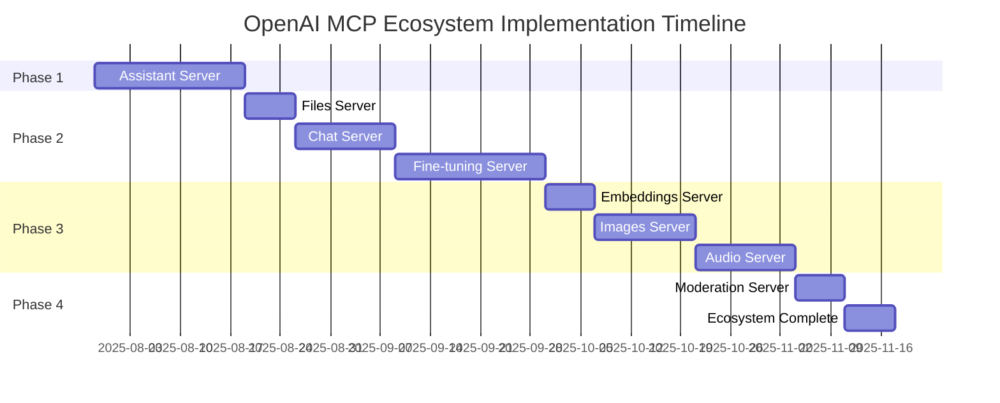

# OpenAI MCP Multi-Server Ecosystem - Comprehensive Planning Document

**Version**: 1.0  
**Date**: July 29, 2025  
**Status**: Strategic Planning Phase  

## Executive Summary

This document outlines the strategic plan for creating a comprehensive multi-server MCP (Model Context Protocol) ecosystem that provides complete OpenAI API coverage through specialized, independent servers. Building on the proven success of our Vector Store MCP server (15 tools, production-ready), this ecosystem will deliver modular, scalable, and maintainable access to all OpenAI capabilities.

## 1. Ecosystem Overview

### 1.1 Architecture Philosophy

**Microservices-First Design**
- Each server specializes in a specific OpenAI API domain
- Independent deployment and scaling per server
- Clear separation of concerns and responsibilities
- Fault isolation - failure in one server doesn't affect others

**Proven Pattern Replication**
- Copy and adapt the successful Vector Store server architecture
- Independent codebases with consistent patterns
- No shared dependencies or complex orchestration
- Simple, maintainable, and debuggable implementations

**Edge-First Deployment**
- Each server deployed as a separate Cloudflare Worker
- Independent domains for each server (e.g., `assistants-mcp.example.com`)
- Global edge distribution for optimal performance
- Zero cold starts and automatic scaling

### 1.2 Benefits of Multi-Server Approach

**vs. Monolithic Server:**
- **Focused Expertise**: Each server becomes an expert in its domain
- **Independent Evolution**: Servers can evolve at different paces
- **Reduced Complexity**: Smaller, more manageable codebases
- **Better Testing**: Isolated testing and validation per domain
- **Fault Isolation**: Issues in one domain don't affect others
- **Team Ownership**: Different teams can own different servers

**vs. Shared Library Approach:**
- **No Dependency Hell**: Each server is completely independent
- **Deployment Flexibility**: Deploy updates to individual servers
- **Version Independence**: Servers can use different MCP versions
- **Simplified Debugging**: Issues are contained within single servers
- **Easier Onboarding**: New developers can focus on one domain

### 1.3 Server Communication Patterns

**Client-Side Orchestration**
- MCP clients configure multiple servers independently
- No server-to-server communication required
- Clients handle cross-domain workflows
- Simple, predictable interaction patterns

**Shared Authentication Model**
- Consistent URL-based API key pattern: `/mcp/{openai-api-key}`
- Each server validates the same OpenAI API key
- No additional authentication infrastructure needed
- Secure, stateless, and simple to implement

## 2. Server Specifications

### 2.1 Current: Vector Store MCP Server ✅
**Status**: Production Ready  
**Domain**: `vector-store-mcp.example.com`  
**Scope**: Vector stores, files, and batch operations  
**Tools**: 15 comprehensive tools  
**API Coverage**: Complete Vector Store API  

**Tools Provided:**
- Core Operations: create, list, get, delete, modify
- File Management: add, list, get, content, update, delete
- Batch Operations: create, get, cancel, list files

### 2.2 Priority 1: Assistant MCP Server 🚧
**Status**: Next Implementation  
**Domain**: `assistants-mcp.example.com`  
**Scope**: Assistants, threads, messages, runs, and run steps  
**Estimated Tools**: ~22 tools  
**API Coverage**: Complete Assistants API  

**Planned Tools:**
- **Assistant Management** (5 tools):
  - `assistant-create`: Create new assistant with instructions and tools
  - `assistant-list`: List all assistants with pagination
  - `assistant-get`: Retrieve specific assistant details
  - `assistant-modify`: Update assistant configuration
  - `assistant-delete`: Remove assistant permanently

- **Thread Management** (4 tools):
  - `thread-create`: Create new conversation thread
  - `thread-get`: Retrieve thread details
  - `thread-modify`: Update thread metadata
  - `thread-delete`: Remove thread permanently

- **Message Management** (6 tools):
  - `message-create`: Add message to thread
  - `message-list`: List messages in thread
  - `message-get`: Retrieve specific message
  - `message-modify`: Update message metadata
  - `message-file-list`: List files attached to message
  - `message-file-get`: Retrieve message file details

- **Run Management** (7 tools):
  - `run-create`: Start assistant run on thread
  - `run-list`: List runs for thread
  - `run-get`: Retrieve run details and status
  - `run-modify`: Update run metadata
  - `run-cancel`: Cancel running execution
  - `run-submit-tool-outputs`: Submit tool call results
  - `run-step-list`: List steps in run execution

### 2.3 Priority 2: Files MCP Server 📁
**Status**: Planned  
**Domain**: `files-mcp.example.com`  
**Scope**: File upload, management, and content retrieval  
**Estimated Tools**: ~6 tools  
**API Coverage**: Complete Files API  

**Planned Tools:**
- `file-upload`: Upload file for use with OpenAI services
- `file-list`: List all uploaded files
- `file-get`: Retrieve file metadata
- `file-delete`: Remove file permanently
- `file-content`: Download file content
- `file-purpose-list`: List files by purpose (fine-tune, assistants, etc.)

### 2.4 Priority 3: Chat Completions MCP Server 💬
**Status**: Planned  
**Domain**: `chat-mcp.example.com`  
**Scope**: Chat completions and conversation management  
**Estimated Tools**: ~8 tools  
**API Coverage**: Complete Chat API  

**Planned Tools:**
- `chat-completion-create`: Generate chat completion
- `chat-completion-stream`: Stream chat completion responses
- `chat-completion-get`: Retrieve specific completion
- `chat-completion-list`: List recent completions
- `chat-completion-modify`: Update completion metadata
- `chat-completion-delete`: Remove completion record
- `chat-function-call`: Handle function calling workflows
- `chat-structured-output`: Generate structured JSON responses

### 2.5 Priority 4: Fine-tuning MCP Server 🎯
**Status**: Planned  
**Domain**: `fine-tuning-mcp.example.com`  
**Scope**: Model fine-tuning and training management  
**Estimated Tools**: ~12 tools  
**API Coverage**: Complete Fine-tuning API  

**Planned Tools:**
- **Job Management** (6 tools):
  - `fine-tune-create`: Start new fine-tuning job
  - `fine-tune-list`: List all fine-tuning jobs
  - `fine-tune-get`: Retrieve job details and status
  - `fine-tune-cancel`: Cancel running job
  - `fine-tune-resume`: Resume paused job
  - `fine-tune-pause`: Pause running job

- **Monitoring & Analysis** (6 tools):
  - `fine-tune-events`: List training events and logs
  - `fine-tune-checkpoints`: List model checkpoints
  - `fine-tune-metrics`: Retrieve training metrics
  - `fine-tune-permissions-list`: List job permissions
  - `fine-tune-permissions-create`: Grant job access
  - `fine-tune-permissions-delete`: Revoke job access

### 2.6 Priority 5: Embeddings MCP Server 🔍
**Status**: Planned  
**Domain**: `embeddings-mcp.example.com`  
**Scope**: Text embeddings and similarity operations  
**Estimated Tools**: ~4 tools  
**API Coverage**: Complete Embeddings API  

**Planned Tools:**
- `embedding-create`: Generate embeddings for text
- `embedding-batch`: Process multiple texts efficiently
- `embedding-similarity`: Calculate similarity between embeddings
- `embedding-search`: Find similar embeddings in dataset

### 2.7 Priority 6: Images MCP Server 🎨
**Status**: Planned  
**Domain**: `images-mcp.example.com`  
**Scope**: Image generation, editing, and variations  
**Estimated Tools**: ~8 tools  
**API Coverage**: Complete Images API  

**Planned Tools:**
- **Generation** (3 tools):
  - `image-generate`: Create images from text prompts
  - `image-generate-variations`: Create variations of existing image
  - `image-generate-batch`: Generate multiple images efficiently

- **Editing** (3 tools):
  - `image-edit`: Edit images with text instructions
  - `image-inpaint`: Fill masked areas of images
  - `image-outpaint`: Extend images beyond original boundaries

- **Management** (2 tools):
  - `image-list`: List generated images
  - `image-delete`: Remove image records

### 2.8 Priority 7: Audio MCP Server 🎵
**Status**: Planned  
**Domain**: `audio-mcp.example.com`  
**Scope**: Speech synthesis, transcription, and translation  
**Estimated Tools**: ~6 tools  
**API Coverage**: Complete Audio API  

**Planned Tools:**
- **Speech Synthesis** (2 tools):
  - `audio-speech-create`: Convert text to speech
  - `audio-speech-stream`: Stream speech generation

- **Transcription** (2 tools):
  - `audio-transcribe`: Convert speech to text
  - `audio-transcribe-batch`: Process multiple audio files

- **Translation** (2 tools):
  - `audio-translate`: Translate speech to English text
  - `audio-translate-batch`: Translate multiple audio files

### 2.9 Priority 8: Moderation MCP Server 🛡️
**Status**: Planned  
**Domain**: `moderation-mcp.example.com`  
**Scope**: Content moderation and safety checks  
**Estimated Tools**: ~4 tools  
**API Coverage**: Complete Moderation API  

**Planned Tools:**
- `moderation-check`: Check content for policy violations
- `moderation-batch`: Check multiple content items
- `moderation-categories`: List available moderation categories
- `moderation-history`: Retrieve moderation check history

### 2.10 Future Considerations

**Specialized Servers** (Lower Priority):
- **Realtime MCP Server**: Real-time conversation API
- **Evals MCP Server**: Model evaluation and testing
- **Administration MCP Server**: Account and project management
- **Completions MCP Server**: Legacy completions API (if needed)

## 3. Technical Architecture

### 3.1 Shared Architectural Patterns

**File Structure Template** (Replicated across all servers):
```
src/
├── worker.ts              # Cloudflare Worker entry point
├── mcp-handler.ts         # MCP protocol implementation
├── types.ts               # TypeScript type definitions
└── services/
    └── openai-service.ts  # OpenAI API client wrapper
```

**Core Components** (Consistent across servers):

1. **Worker Entry Point** ([`worker.ts`](src/worker.ts)):
   - HTTP request routing and CORS handling
   - URL-based authentication (`/mcp/{api-key}`)
   - Error boundary and response formatting
   - Health check endpoint

2. **MCP Protocol Handler** ([`mcp-handler.ts`](src/mcp-handler.ts)):
   - JSON-RPC 2.0 protocol implementation
   - Tool definition and registration
   - Request validation and routing
   - Response formatting

3. **OpenAI Service Layer** ([`services/openai-service.ts`](src/services/openai-service.ts)):
   - Domain-specific API client wrapper
   - Error handling and retry logic
   - Request/response transformation
   - Rate limiting and optimization

4. **Type Definitions** ([`types.ts`](src/types.ts)):
   - MCP protocol types
   - OpenAI API types for the domain
   - Environment and configuration types

### 3.2 Authentication & Security

**Consistent Authentication Pattern**:
- URL path: `/mcp/{openai-api-key}`
- Direct OpenAI API key validation
- No additional authentication layers
- Secure HTTPS-only communication

**Security Measures**:
- API keys never logged or exposed
- Input validation on all parameters
- CORS headers for web client support
- Rate limiting inherited from OpenAI API

### 3.3 Error Handling Strategy

**Standardized Error Responses**:
```json
{
  "jsonrpc": "2.0",
  "error": {
    "code": -32603,
    "message": "OpenAI API error: Rate limit exceeded"
  },
  "id": 1
}
```

**Error Code Mapping**:
- `-32700`: Parse error (invalid JSON)
- `-32600`: Invalid request (malformed MCP)
- `-32601`: Method not found (unknown tool)
- `-32602`: Invalid params (missing/invalid parameters)
- `-32603`: Internal error (OpenAI API errors)

### 3.4 Performance Optimizations

**Cloudflare Workers Benefits**:
- Global edge deployment (sub-100ms latency)
- Zero cold starts
- Automatic scaling
- Built-in DDoS protection

**Implementation Optimizations**:
- Minimal dependencies (TypeScript types only)
- Efficient JSON parsing and validation
- Direct API calls without middleware
- Optimized memory usage

### 3.5 Monitoring & Observability

**Built-in Cloudflare Analytics**:
- Request volume and latency metrics
- Error rates and status codes
- Geographic distribution analysis
- Performance trending

**Custom Logging Strategy**:
- Error details (without sensitive data)
- Performance metrics and timing
- Usage patterns and tool popularity
- Health check status

## 4. Implementation Roadmap

### 4.1 Phase 1: Assistant MCP Server (Immediate Priority)
**Timeline**: 2-3 weeks  
**Effort**: High  
**Dependencies**: None  

**Deliverables**:
- Complete Assistant API coverage (22 tools)
- Production deployment on Cloudflare Workers
- Comprehensive testing and validation
- Client integration documentation
- Usage examples and demos

**Success Criteria**:
- All 22 tools implemented and tested
- Sub-100ms response times
- Compatible with Claude Desktop and Roo
- Complete API coverage validation
- Production-ready deployment

### 4.2 Phase 2: Core API Servers (High-Value Domains)
**Timeline**: 4-6 weeks  
**Effort**: Medium-High  
**Dependencies**: Phase 1 completion  

**Servers to Implement**:
1. **Files MCP Server** (6 tools) - 1 week
2. **Chat Completions MCP Server** (8 tools) - 2 weeks
3. **Fine-tuning MCP Server** (12 tools) - 2-3 weeks

**Success Criteria**:
- Each server independently deployable
- Complete API coverage for each domain
- Consistent patterns and quality
- Client integration guides
- Performance benchmarks

### 4.3 Phase 3: Specialized API Servers
**Timeline**: 4-5 weeks  
**Effort**: Medium  
**Dependencies**: Phase 2 completion  

**Servers to Implement**:
1. **Embeddings MCP Server** (4 tools) - 1 week
2. **Images MCP Server** (8 tools) - 2 weeks
3. **Audio MCP Server** (6 tools) - 2 weeks

**Success Criteria**:
- Specialized domain expertise
- Optimized for specific use cases
- Integration with existing ecosystem
- Performance optimization
- Advanced feature support

### 4.4 Phase 4: Complete Ecosystem Coverage
**Timeline**: 2-3 weeks  
**Effort**: Low-Medium  
**Dependencies**: Phase 3 completion  

**Servers to Implement**:
1. **Moderation MCP Server** (4 tools) - 1 week
2. **Additional Specialized Servers** - 1-2 weeks

**Success Criteria**:
- 100% OpenAI API coverage
- Ecosystem documentation
- Integration patterns
- Best practices guide
- Migration strategies

### 4.5 Timeline Summary



**Total Timeline**: ~16 weeks (4 months)  
**Total Estimated Tools**: ~75 tools across 9 servers  

## 5. Integration Guide

### 5.1 Multi-Server Client Configuration

**Claude Desktop Configuration**:
```json
{
  "mcpServers": {
    "openai-vector-store": {
      "command": "npx",
      "args": ["mcp-proxy", "https://vector-store-mcp.example.com/mcp/YOUR_API_KEY"]
    },
    "openai-assistants": {
      "command": "npx", 
      "args": ["mcp-proxy", "https://assistants-mcp.example.com/mcp/YOUR_API_KEY"]
    },
    "openai-files": {
      "command": "npx",
      "args": ["mcp-proxy", "https://files-mcp.example.com/mcp/YOUR_API_KEY"]
    },
    "openai-chat": {
      "command": "npx",
      "args": ["mcp-proxy", "https://chat-mcp.example.com/mcp/YOUR_API_KEY"]
    }
  }
}
```

**Roo Configuration**:
```json
{
  "mcpServers": {
    "openai-vector-store": {
      "command": "npx",
      "args": ["mcp-proxy", "https://vector-store-mcp.example.com/mcp/YOUR_API_KEY"],
      "alwaysAllow": ["vector-store-*"]
    },
    "openai-assistants": {
      "command": "npx",
      "args": ["mcp-proxy", "https://assistants-mcp.example.com/mcp/YOUR_API_KEY"],
      "alwaysAllow": ["assistant-*", "thread-*", "message-*", "run-*"]
    }
  }
}
```

### 5.2 Cross-Server Workflow Patterns

**Example: Complete Assistant Workflow**
```
1. Upload training data → Files Server
2. Create assistant → Assistants Server  
3. Create conversation thread → Assistants Server
4. Add user message → Assistants Server
5. Run assistant → Assistants Server
6. Store results in vector store → Vector Store Server
```

**Example: Content Generation Pipeline**
```
1. Generate initial content → Chat Server
2. Create images for content → Images Server
3. Generate audio narration → Audio Server
4. Check content safety → Moderation Server
5. Store final content → Files Server
```

### 5.3 Server Selection Guidelines

**When to Use Each Server**:

- **Vector Store Server**: Document storage, semantic search, RAG systems
- **Assistants Server**: Conversational AI, multi-turn interactions, tool usage
- **Files Server**: Document management, file preprocessing, content storage
- **Chat Server**: Single-turn completions, quick responses, function calling
- **Fine-tuning Server**: Model customization, domain adaptation, training
- **Embeddings Server**: Similarity search, clustering, recommendation systems
- **Images Server**: Visual content generation, image editing, creative workflows
- **Audio Server**: Voice interfaces, transcription, audio content creation
- **Moderation Server**: Content safety, policy compliance, risk assessment

### 5.4 Best Practices for Multi-Server Usage

**Configuration Management**:
- Use environment variables for API keys
- Centralize server URL configuration
- Implement fallback mechanisms
- Monitor server health across ecosystem

**Error Handling**:
- Implement retry logic for transient failures
- Handle server-specific error patterns
- Provide graceful degradation
- Log errors with server context

**Performance Optimization**:
- Cache frequently used data
- Implement request batching where possible
- Use appropriate servers for specific tasks
- Monitor and optimize cross-server workflows

## 6. Naming and Branding Strategy

### 6.1 Server Naming Convention

**Domain Pattern**: `{domain}-mcp.example.com`
- `vector-store-mcp.example.com` ✅ (Current)
- `assistants-mcp.example.com` (Next)
- `files-mcp.example.com`
- `chat-mcp.example.com`
- `fine-tuning-mcp.example.com`
- `embeddings-mcp.example.com`
- `images-mcp.example.com`
- `audio-mcp.example.com`
- `moderation-mcp.example.com`

**Repository Naming**: `openai-{domain}-mcp`
- `openai-vector-store-mcp` ✅ (Current)
- `openai-assistants-mcp` (Next)
- `openai-files-mcp`
- `openai-chat-mcp`
- etc.

### 6.2 Tool Naming Convention

**Pattern**: `{domain}-{action}-{object?}`

**Examples**:
- Vector Store: `vector-store-create`, `vector-store-file-add`
- Assistants: `assistant-create`, `thread-create`, `run-submit-tool-outputs`
- Files: `file-upload`, `file-delete`, `file-content`
- Chat: `chat-completion-create`, `chat-function-call`

**Benefits**:
- Clear domain identification
- Consistent action verbs
- Hierarchical organization
- Easy to remember and discover

### 6.3 Branding and Documentation

**Ecosystem Branding**: "OpenAI MCP Ecosystem"
- Unified documentation site
- Consistent visual identity
- Cross-server examples
- Integration guides

**Individual Server Branding**:
- Domain-specific expertise positioning
- Specialized use case focus
- Independent but coordinated messaging
- Clear value propositions

### 6.4 Documentation Structure

**Ecosystem-Level Documentation**:
- Overview and architecture guide
- Multi-server integration patterns
- Best practices and recommendations
- Migration and adoption guides

**Server-Level Documentation**:
- API reference and tool documentation
- Domain-specific examples
- Performance characteristics
- Troubleshooting guides

## 7. Deployment and Scaling Considerations

### 7.1 Independent Deployment Strategy

**Per-Server Deployment**:
- Each server has its own Cloudflare Worker
- Independent deployment pipelines
- Separate monitoring and alerting
- Individual scaling characteristics

**Benefits**:
- Zero-downtime deployments per server
- Independent release cycles
- Isolated failure domains
- Granular performance optimization

### 7.2 Infrastructure Requirements

**Cloudflare Workers Configuration**:
- Standard Worker limits (128MB memory, 30s CPU time)
- Custom domains for each server
- Environment variable management
- SSL/TLS certificate handling

**Monitoring and Alerting**:
- Per-server health checks
- Aggregate ecosystem monitoring
- Performance dashboards
- Error rate alerting

### 7.3 Scaling Characteristics

**Automatic Scaling**:
- Cloudflare Workers handle traffic spikes automatically
- No manual scaling configuration required
- Global edge distribution
- Pay-per-request pricing model

**Performance Optimization**:
- Server-specific optimizations
- Domain-focused caching strategies
- Efficient API client implementations
- Minimal cold start overhead

### 7.4 Cost Management

**Predictable Costs**:
- Cloudflare Workers pricing: $0.50 per million requests
- OpenAI API costs passed through to users
- No infrastructure management overhead
- Transparent cost structure

**Cost Optimization**:
- Efficient request handling
- Minimal memory usage
- Optimized API calls
- Request batching where appropriate

## 8. Risk Assessment and Mitigation

### 8.1 Technical Risks

**Risk**: OpenAI API Changes
- **Impact**: Medium - Could break server functionality
- **Mitigation**: Version pinning, automated testing, gradual rollouts
- **Monitoring**: API deprecation notices, breaking change alerts

**Risk**: Cloudflare Workers Limitations
- **Impact**: Low - Well-understood platform constraints
- **Mitigation**: Efficient implementations, resource monitoring
- **Monitoring**: Performance metrics, resource usage tracking

**Risk**: MCP Protocol Evolution
- **Impact**: Medium - Protocol changes could require updates
- **Mitigation**: Version compatibility, gradual migration strategies
- **Monitoring**: MCP specification updates, community feedback

### 8.2 Operational Risks

**Risk**: Server Availability
- **Impact**: Medium - Individual server outages
- **Mitigation**: Independent deployments, health monitoring
- **Monitoring**: Uptime tracking, error rate alerting

**Risk**: API Key Management
- **Impact**: High - Security and access control
- **Mitigation**: Secure key handling, validation, rotation support
- **Monitoring**: Authentication failures, usage patterns

**Risk**: Rate Limiting
- **Impact**: Medium - OpenAI API rate limits
- **Mitigation**: Efficient request patterns, user education
- **Monitoring**: Rate limit headers, error tracking

### 8.3 Business Risks

**Risk**: Ecosystem Complexity
- **Impact**: Medium - User confusion, adoption barriers
- **Mitigation**: Clear documentation, migration guides, examples
- **Monitoring**: User feedback, adoption metrics

**Risk**: Maintenance Overhead
- **Impact**: Medium - Multiple servers to maintain
- **Mitigation**: Consistent patterns, automated testing, documentation
- **Monitoring**: Development velocity, bug reports

## 9. Success Metrics and KPIs

### 9.1 Technical Metrics

**Performance**:
- Response time < 100ms (excluding OpenAI API time)
- 99.9% uptime per server
- Error rate < 0.1% for valid requests
- Cold start time < 50ms

**Coverage**:
- 100% OpenAI API endpoint coverage
- All documented parameters supported
- Complete error handling
- Full type safety

### 9.2 Adoption Metrics

**Usage**:
- Number of active servers deployed
- Total API calls per server
- Unique users per month
- Tool usage distribution

**Integration**:
- MCP client compatibility
- Documentation completeness
- Example coverage
- Community contributions

### 9.3 Quality Metrics

**Reliability**:
- Bug reports per server
- Time to resolution
- User satisfaction scores
- Documentation quality ratings

**Maintainability**:
- Code complexity metrics
- Test coverage percentage
- Development velocity
- Onboarding time for new contributors

## 10. Conclusion and Next Steps

### 10.1 Strategic Value

The OpenAI MCP Multi-Server Ecosystem represents a significant advancement in AI integration capabilities:

- **Complete Coverage**: 100% OpenAI API functionality through specialized servers
- **Proven Architecture**: Building on the successful Vector Store server pattern
- **Scalable Design**: Independent servers that can evolve and scale independently
- **Developer Experience**: Simple, consistent, and powerful integration patterns
- **Future-Proof**: Modular design that can adapt to OpenAI API evolution

### 10.2 Immediate Actions

1. **Begin Assistant MCP Server Development** (Phase 1)
   - Set up repository and development environment
   - Implement core assistant management tools
   - Establish testing and validation framework

2. **Finalize Architecture Patterns**
   - Document shared components and patterns
   - Create development templates and guidelines
   - Establish quality and testing standards

3. **Plan Infrastructure**
   - Set up Cloudflare Workers accounts and domains
   - Configure monitoring and alerting systems
   - Establish deployment pipelines

### 10.3 Long-term Vision

This ecosystem will become the definitive way to integrate OpenAI capabilities into AI applications:

- **Industry Standard**: The go-to solution for OpenAI API integration
- **Community Driven**: Open source with active community contributions
- **Continuously Evolving**: Regular updates to match OpenAI API evolution
- **Enterprise Ready**: Production-grade reliability and performance

### 10.4 Call to Action

The foundation is solid, the plan is comprehensive, and the opportunity is significant. The next step is execution - beginning with the Assistant MCP Server that will demonstrate the full potential of this multi-server ecosystem approach.

**Ready to build the future of AI integration? Let's start with Phase 1.**

---

*This document serves as the strategic blueprint for the OpenAI MCP Multi-Server Ecosystem. It will be updated as the project evolves and new requirements emerge.*